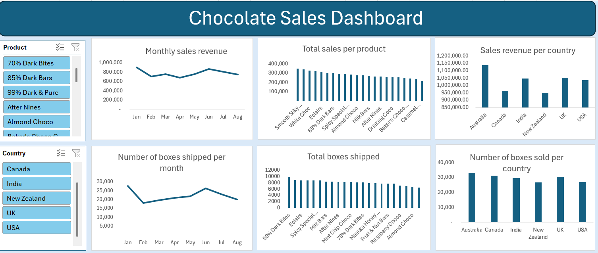

# Project 1

**Title:** 

[Chocolate Sales Interactive Dashboard](https://github.com/BinahUtuedor/binahutuedor.github.io/blob/main/Chocolate%20Sales%20Dashboard.xlsx)

**Tools Used:** 
Microsoft Excel, Pivot Tables, Pivot Charts, Line Charts, Bar Charts, Slicers

**Project Description:** 
This project involved analysing the sales data of a chocolate company to identify trends and patterns in sales performance for the first eight months of the year 2022. It is designed to provide a comprehensive overview of key performance metrics. This dashboard allows stakeholders to easily monitor and analyze the company’s monthly sales volumes across various countries. The dashboard includes the following features:

**Sales Revenue:** 
Visual representation of sales revenue broken down by the total monthly sales for each of the first eight months of the year, total sales per product for the period under review,  and total sales revenue per country for the same period.

**Number of chocolate boxes sold:**
A breakdown of the total number of boxes shipped per month, the total number of boxes shipped per product for the period under review, and the total number of boxes shipped to each country.

Additionally, the dashboard includes interactive slicers for:

**Product:** Filters the data to view performance for a specific product or a range of products.

**Country:** Focuses on a specific country or countries to analyze regional performance.

**Key findings:** 

*Sales Revenue:* 
Identified the months, countries, and products with the highest sales revenue and the corresponding number of boxes shipped per product. The charts show that revenue derived from sales per month and country increases with the number of boxes of chocolate shipped. However, the revenue generated from each chocolate type does not directly relate to the number of boxes of that chocolate type shipped. 

*Top-Performing Products:* 
Highlighted which chocolate brands are driving the most revenue, aiding in inventory and marketing decisions.

*Sales Volatility:*
Analyzed monthly sales fluctuations to understand market dynamics and adjust business strategies accordingly.

This dashboard serves as a crucial tool for the chocolate company’s management team, providing clear, actionable insights that drive informed decision-making and strategic planning.

**Dashboard Overview:**

# Project 2

**Title:**
Cars Data Interrogation and Manipulation

**SQL Code:**
[Cars SQL Code](https://github.com/BinahUtuedor/binahutuedor.github.io/blob/main/Cars.sql)

**SQL Skills Used:**
Data Retrieval (SELECT): Queried and extracted specific information from the database.
Data Aggregation (COUNT): Counted records to analyze data trends.
Data Filtering (WHERE, IN, AND): Applied filters to select relevant data, including filtering by lists.
Data Source Specification (FROM): Specified the tables used as data sources for retrieval

**Project Description:**
This project focuses on analyzing a comprehensive dataset containing detailed information about approximately 8,000 car records. The primary objective is to utilize SQL to extract meaningful insights regarding product demographics, performance metrics, and other relevant attributes.
*Database Design and Implementation:* Develop a relational database schema to effectively store and manage the cars' data, ensuring normalization and referential integrity.
Data Analysis Using SQL: Execute SQL queries to analyze various aspects of the dataset, including car demographics (e.g., make, year, number of seats, fuel type), and financial attributes (e.g., sales price, market value).
*Insight Extraction:* Identify patterns and trends within the data, such as: Nationalities with the highest representation among players. Correlation between player attributes and performance metrics. Distribution of players across different clubs and leagues.
*Reporting and Visualization:* Present the findings through comprehensive reports and visualizations to facilitate better understanding and decision-making. By the end of this project, we aim to have a fully functional SQL database capable of providing in-depth analysis of football players' data, offering valuable insights for stakeholders such as team managers, scouts, and analysts
 
**Technology used:** 
SQL Server

# Project 3

**Title:** 
[MTN Performance Interactive Dashboard](https://github.com/BinahUtuedor/binahutuedor.github.io/blob/main/MTN%20Performance%20Dashboard.pbix)

**Tools Used:** 
Microsoft Power BI, Line Charts, Bar Charts, Slicers

**Project Description:** 
This project involved analysing the product data of a telecommunications company to identify trends and patterns in customer attrition and sales performance between January and March 2025. It is designed to provide a comprehensive overview of key performance metrics. This dashboard allows stakeholders to easily monitor and analyze the company’s performance across different regions, products, and periods. The dashboard includes the following features:
Profit by Country and Cookies: Visual representation of profits broken down by each country and type of cookie.
Total Units Sold per Month: A monthly breakdown of the total units sold, providing insights into sales trends over time.
Profit by Month: Displays the monthly profit, allowing for easy profitability comparison throughout the year.
Total Revenue by Country: Highlights the total revenue generated in each country, showcasing the performance in different markets.
Additionally, the dashboard includes interactive slicers and a timeline for:
Month: Filter the data to view performance for a specific month or range of months.
Country: Focus on specific countries to analyze regional performance.
Product: Drill down into the performance of individual cookie products.

**Key findings:** 
Regional Profitability: Identified the most profitable countries and highlighted regions where performance could be improved.
Seasonal Trends: Revealed patterns in sales and profit that correspond with seasonal events, allowing for more strategic planning.
Top-Performing Products: Highlighted which cookie products drive the most revenue and profit, aiding in inventory and marketing decisions.
Sales Volatility: Analyzed monthly sales fluctuations to understand market dynamics and adjust business strategies accordingly.
This dashboard is a crucial tool for the cookies company’s management team, providing clear, actionable insights that drive informed decision-making and strategic planning.

**Dashboard Overview:**

